**Linux Kernel Debugging**

**Using Virtual Box**

**By Matt K**

**5/5/2020**

**Version 1.0**

# Abstract

**This article discusses how to utilize Oracle Virtual Box Virtual Machines (VM) to perform debugging of a Linux kernel using the GNU Debugger (GDB). Two VMs will be created; the "Target VM" to be debugged and the "Debugging VM". Ubuntu 18.04 LTS Desktop was used to create both VMs. The goal of this article is to show how to create an interactive kernel debugging/development environment and to show examples of this environment in action.**

# Description

**First some background.**

**Virtual Box 6.0.20 was used for this article. If you need to download it go to** <https://www.virtualbox.org/wiki/Downloads>.

**Ubuntu 18.04 LTS desktop was used for both the target and the debugging VMs. It can be downloaded as an ISO image from** <https://releases.ubuntu.com/18.04.4/> **to your desktop. Start by creating two VMs from the ISO in Virtual Box. It is assumed that you know how to perform this action. The following are the settings used for each VM in this article.**

**[The Debugging VM]{.underline} -- name = Ubuntu-18.04-Desktop-Matt**

-   **8GB RAM**

-   **2 CPUs**

-   **Display: 128 MB**

-   **Storage 80 GB**

-   **Network -- NAT**

-   **Serial Ports**

    -   **Enable Serial Port (checked)**

    -   **Leave defaults- Port Number: COM1, IRQ: 4, I/O Port 0x3F8**

    -   **Connect to existing pipe/socket (checked)**

    -   **Path/Address: \\\\.\\pipe\\target**

-   **Shared Folder: set this up so you can share from VM to VM ( you will need to transfer the compiled Linux kernel image and source code.**

**The hostname for this machine was set to ubuntu-matt**

**[The Target VM]{.underline} -- name = Ubuntu-18.04-Desktop-target**

-   **8GB RAM**

-   **1 CPUs**

-   **Display: 128 MB**

-   **Storage 80 GB**

-   **Network -- NAT**

-   **Serial Ports**

    -   **Enable Serial Port (checked)**

    -   **Leave defaults- Port Number: COM1, IRQ: 4, I/O Port 0x3F8**

    -   **Connect to existing pipe/socket (unchecked)**

    -   **Path/Address: \\\\.\\pipe\\target**

-   **Shared Folder: set this up so you can share from VM to VM ( you will need to transfer the compiled Linux kernel image and source code.**

**The hostname for this machine was set to ubuntu-target**

# Contents: 

1.  Preparing the Target VM

    1.  Download the kernel Source Code

    2.  Compile the kernel Source Code

    3.  Modify GRUB

    4.  Enable the SysRq function

2.  Preparing the Debugging VM

    1.  Download the kernel Source Code

    2.  Prepare kernel Source Code

    3.  Transfer compiled kernel to Debugging VM

    4.  Prepare Debugging VM Tools

3.  Download and Install Eclipse

    1.  How to Load Source Code into Eclipse

4.  First GDB Debugging Session

5.  Test of GDB

6.  GDB Panic Tips

7.  Conclusions

8.  References

9.  Appendix A

## 1. Preparing Target VM

Temporarily change the number of CPUs from 1 to the max you can. This will help in compiling the kernel. The Target VM was initially installed as Desktop from the ISO. The Desktop ISO install defaults to entering Run Level 5 -- GUI mode to make it easier to edit and install tools. Once we get to the GRUB step below, we will set it to Run Level 3 -- command line.

### 1.1 Download the kernel Source Code

Open a web browser to <https://www.kernel.org/>

Choose **longterm: 5.4.36** or the most recent longterm. Download the tarball.

### 1.2 Compile the kernel Source Code

All the following steps are performed as root.

Create a directory at **/root/make\_kernel** and change directory to that location:

```
# mkdir /root/make_kernel
```

cd /root/make\_kernel

Copy the downloaded linux-5.4.36.tar.xz file to this location.

Perform the following steps to extract the source:

```
# unxz -v linux-5.4.36.tar.xz
# tar xvf linux-5.4.36.tar
```

You should now have a new directory **linux-5.4.36**. Change to that location.

```
# cd linux-5.4.36
```

Make sure all the GCC and development tools are installed:

```
# apt-get update
# apt-get install build-essential libncurses-dev bison flex libssl-dev libelf-dev
```

Make the .config file:

```
# make defconfig
```

Now edit the .config file and add the following parameters at the end:

```
CONFIG_FRAME_POINTER=y
CONFIG_KGDB=y
CONFIG_KGDB_SERIAL_CONSOLE=y
CONFIG_DEBUG_INFO=y
```

The next step is to compile the linux kernel from source. This can take several minutes depending on how many CPUs you assigned to this VM. Given that the max number of CPUs you assigned above is N, in the command below replace N with your actual number of CPUs you configured:

```
# make -j N
```

Next step is to make install modules:

```
# make modules\_install
```

The final step creates an ELF file called "vmlinux" which is our compiled kernel with all its symbols:

```
# make install
```

You can verify that this is an ELF file by typing the following:

```
# file vmlinux
vmlinux: ELF 64-bit LSB executable, x86-64, version 1 (SYSV), statically linked, BuildID[sha1]=bad83ebe0a05e420ccaef6d6b4061878a51b3584, with debug_info, not stripped
```

At this point you should change the number of CPUs (in Virtual Box) (for the Target VM only) back to 1 to make debugging easier. Debugging in a multi-CPU environment is an order of magnitude more difficult.

### 1.3 Modify GRUB

The GRUB configuration file is located at /etc/default/grub

Add the following to the linux line:

```
GRUB_CMDLINE_LINUX="nokaslr kgdboc=ttyS0 sysrq_always_enabled kgdbwait 3"
```

This enables a break before anything boots and ultimately goes to Run Level 3 (command line interface) once you enter c (continue) on the Debugging VM GDB session.

Below is an example of the grub file used:

```
# If you change this file, run 'update-grub' afterwards to update
# /boot/grub/grub.cfg.
# For full documentation of the options in this file, see:
# info -f grub -n 'Simple configuration'
GRUB_DEFAULT=0
GRUB_TIMEOUT_STYLE=hidden
GRUB_TIMEOUT=0
GRUB_DISTRIBUTOR=`lsb\_release -i -s 2> /dev/null || echo Debian\`
GRUB_CMDLINE_LINUX_DEFAULT="quiet splash"
GRUB_CMDLINE_LINUX="nokaslr kgdboc=ttyS0 sysrq_always_enabled kgdbwait 3"

# Uncomment to enable BadRAM filtering, modify to suit your needs
# This works with Linux (no patch required) and with any kernel that obtains
# the memory map information from GRUB (GNU Mach, kernel of FreeBSD \...)
#GRUB\_BADRAM=\"0x01234567,0xfefefefe,0x89abcdef,0xefefefef\"

# Uncomment to disable graphical terminal (grub-pc only)
#GRUB\_TERMINAL=console

# The resolution used on graphical terminal
# note that you can use only modes which your graphic card supports via VBE
# you can see them in real GRUB with the command `vbeinfo'
#GRUB_GFXMODE=640x480

# Uncomment if you don't want GRUB to pass "root=UUID=xxx" parameter to Linux
#GRUB_DISABLE_LINUX_UUID=true

# Uncomment to disable generation of recovery mode menu entries
#GRUB_DISABLE_RECOVERY="true"

# Uncomment to get a beep at grub start
#GRUB_INIT_TUNE="480 440 1"
```

The last step in this section is to make these changes permanent by typing:

```
# update-grub
```

### 1.4 Enable the SysRq function

To enable breaking into the debugger (gdb) without setting a breakpoint we need to enable **sysrq**. The sysrq key is a 'magical' key combination you can hit which the kernel will respond to regardless to whatever else it is doing, unless it completely locked up. This enables you to press "alt \<printscreen\> g" to break into the debugger.

To enable sysrq type:

```
# echo "kernel.sysrq = 1" \>\> /etc/sysctl.d/99-sysctl.conf
```

## 2. Preparing the Debugging VM

This VM is where you will be doing all the main debugging operations involving GDB and viewing the kernel source code.

### 2.1 Download the kernel Source Code

Sections 2.1 and 2.2 are identical to sections 1.1 and 1.2.

Open a web browser to <https://www.kernel.org/>

Choose **longterm: 5.4.36** or the most recent longterm. Download the tarball.

### 2.2 Prepare kernel Source Code

Create a directory at **/root/make\_kernel** and change directory to that location:

```
# mkdir /root/make_kernel
# cd /root/make_kernel
```

Copy the downloaded linux-5.4.36.tar.xz file to this location.

Perform the following steps to extract the source:

```
# unxz -v linux-5.4.36.tar.xz
# tar xvf linux-5.4.36.tar
```

You should now have a new directory **linux-5.4.36** which contains all the source code you compiled on the target VM.

### 2.3 Transfer Compiled kernel to Debugging VM

In section 1.2, the kernel was compiled and made available as a file "vmlinux". This file should be transferred from the Target VM to the Debugging VM and placed at /root/make\_kernel on the Debugging VM. Assuming you set up a VM to VM shared folder as described in the Description section, this can easily be performed via that method.

### 2.4 Prepare Debugging VM tools

Start by updating:

```
# apt-get update
# apt-get upgrade
```

Make sure GDB is the latest:

```
# apt-get install gdb
```

## 3. Download and Install Eclipse

Eclipse is an Open source Java based integrated development environment (IDE). This is an optional install but it will make debugging a lot simpler. The author prefers this IDE to enable viewing the source code. Eclipse has good support for viewing C source code for large projects and enables you to jump to definitions and find references for code very quickly. Initially, Eclipse will create an index for your project's source code (you will see a task in the bottom bar in Eclipse for "C/C++ Indexer"), and afterward navigating the code is much easier.

Start by installing java:

```
# apt install default-jre
```

Next step is to download and install eclipse.

Open browser to <https://www.eclipse.org/downloads/>

Click the "Download 64 bit" button and you should get a file "eclipse-inst-linux.tar.gz" downloaded into your \~/Downloads folder.

Go to your \~/Downloads folder and extract the file "eclipse-inst-linux.tar.gz"

```
# tar -xzvf eclipse-inst-linux.tar.gz
```

You should now have a folder "eclipse-installer". Change to that directory.

```
cd eclipse-installer
```

Perform the eclipse install by entering the following:

./eclipse-inst

Choose to install the C/C++ Development tools for Eclipse (CDT).

You should now have a directory where eclipse is installed. Change to that directory and issue the following command.

```
# ./eclipse
```

For our install the location was /root/eclipse/cpp-2020-03/eclipse.

Modifying the kernel may involve root permissions, so I kept all my eclipse directories with root permissions. Normally eclipse does not require root permissions.

### 3.1 How to Load Source Code into Eclipse

**All operations in this section were done as root.**

When eclipse launches, it will ask for a workspace -- just accept the default or create your own location.

Once eclipse loads, create a new "C/C++ Project" by going to File -\> New -\> C/C++ Project. Then select "Makefile Project" and click "Next". Give your project a name and click "Finish".

You should now see your project on the left side of Eclipse under "Project Explorer". Right click your project and select "New" -\> "Folder". Then under "Advanced", select "Link to alternate location (Linked Folder)" and browse to the location where you unzipped the kernel source code and select "Open", then click finish. The C/C++ Indexer should now start running and you can start browsing the source code. You should see something like the below window:

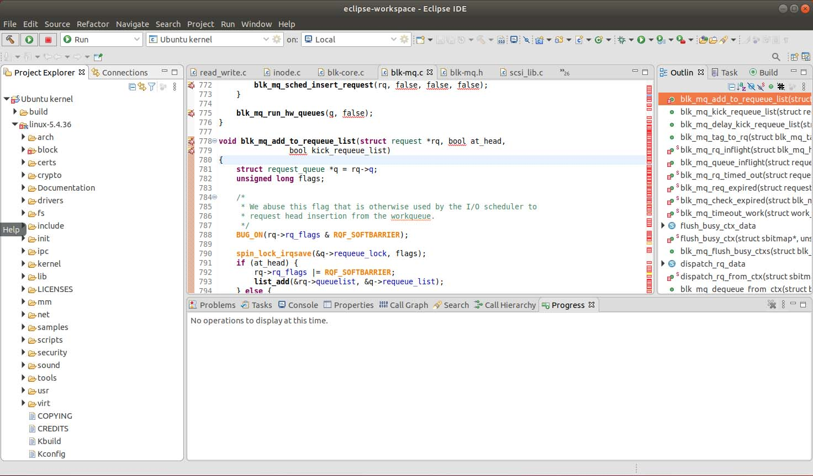{width="4.9534722222222225in" height="2.90625in"}

**Example Eclipse Window**

You can open source code files by expanding the folder locations under "Project Explorer" on the left side of Eclipse, or you can go to a specific file quickly by pressing "Ctrl+Shift+R" and typing the name of the file.

Once the indexer has completed, you can quickly navigate to symbols by pressing "Ctrl+Shift+T" and typing the name or partial name (you can use regexs) of a symbol.

Some files may be too large for the indexer to display -- by default this happens if a file has more than 5000 lines of code. To display these files properly, change the scalability settings by going to "Window" -\> "Preferences" -\> "C/C++" -\> "Editor" -\> "Scalability" and change the setting that says "Enable scalability mode when the number of lines is more than:" to a larger value such as 10000.

Now you have Eclipse set up to navigate the code. If you find you need to enable a symbol such as a compiler switch (you may see areas of code "grayed out" which means they aren't indexed), you can add the symbols by right clicking your project in Project Explorer and going to "Properties" -\> "C/C++ Include Paths and Symbols" -\> "Add Preprocessor Symbol" and set a value such as "FOO=1", then click "Apply and Close" and the Indexer will need to run again to navigate the code correctly.

Navigating the code is as simple as clicking on a symbol in the editor and pressing "F3"to go to its definition. You can also Right click in the editor and find a variety of options for navigating, such as "Open Declaration", "Open Call Hierarchy", "Toggle Source/Header", "References", and "Search Text". Navigating back and forward between symbols and files is as easy as pressing "Alt+Left arrow" for back and "Alt+Right arrow" for forward. Another thing that makes navigating easier is to be able to "Alt+Tab" between open file editors -- you can configure this setting under "Window" -\> "Preferences" -\> "General" -\> "Keys" -\> "\<filter for 'Next Editor'\>"-\> modify the Binding to something convenient like "Alt+1", and click "Apply and Close".

## 4. First GDB Debugging session

The boot order for the two VMs is important. The Target VM should be booted (started) first. If you tried to boot the Debugging VM first it will fail. After you boot the Target VM you should see a screen similar to the one shown below:

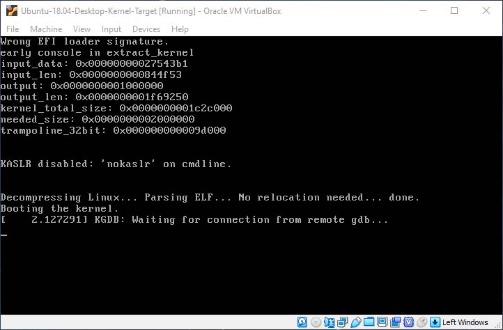{width="4.182638888888889in" height="2.75in"}

**"Target VM" Initial Boot Screen**

Next step is to boot the Debugging VM. Once you log in it should look similar to the below:

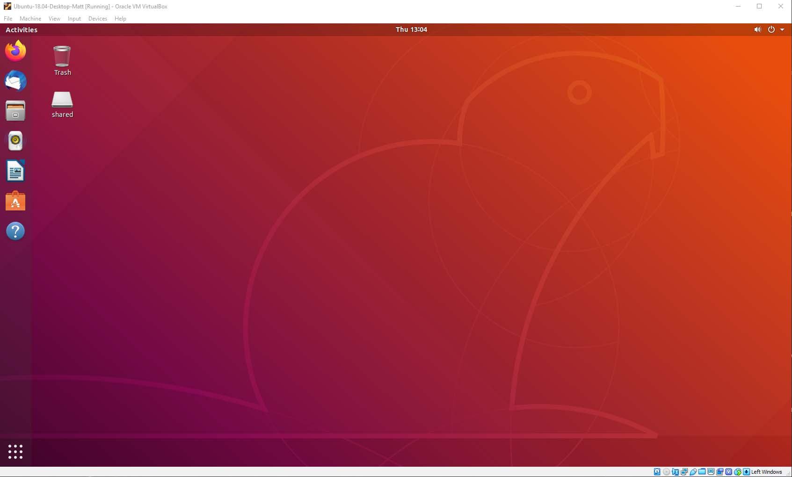{width="4.302083333333333in" height="2.6041666666666665in"}

**"Debugging VM" Initial Login**

Notice there is a folder called "shared". A copy of the compiled kernel "vmlinux" from the Target VM is also at this location.

In order to complete the boot up of the Target VM, open up a terminal on the Debugging VM and enter the commands as shown below:

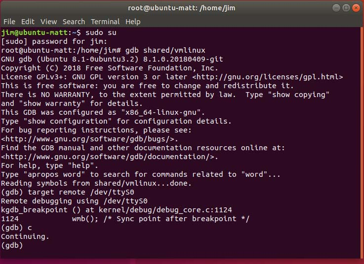{width="4.0625in" height="2.953472222222222in"}

**Terminal on Debugging VM**

Completing the steps shown above should allow the Target VM to complete its boot sequence. The screen below shows the Target VM once it completes its boot sequence:

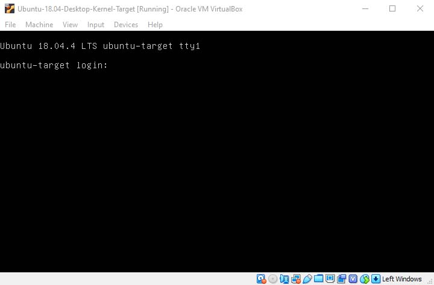{width="3.922222222222222in" height="2.5729166666666665in"}

**"Target VM" after entering continue on "Debugging VM" terminal**

Notice that the Target VM comes up in Run Level 3 -- command line mode. This is because we configured it to do so in the GRUB step above. We set this mode as the default because it boots quicker and for debugging purposes all activity is through a GDB session on the Debugging VM.

Using the terminal window on the Debugging VM we can continue the GDB debugging of the Target VM by setting breakpoints and other GDB commands.

## 5. Test of GDB

On the Debugging VM, use the copy of the compiled kernel "vmlinux" from the shared folder. As root enter the following:

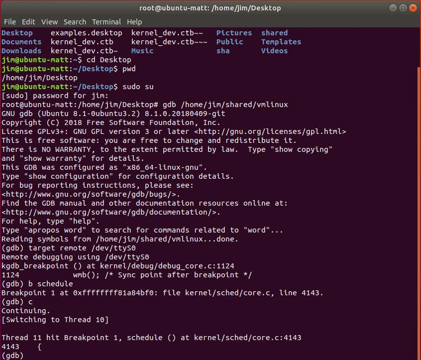{width="4.7243055555555555in" height="4.03125in"}

**Test of gdb**

The above shows setting a breakpoint (b) and continuing (c) verifying all is working.  Note that a conncetion is made from the debugging VM to the target VM over the serial port by entering "target remote /dev/ttyS0" from the gdb command line on the debugging VM.

### 5.1 Viewing the Source Code in GDB

By default, GDB doesn't know where the source code is located. You can tell gdb where the code is located by using the following command:

```
(gdb) dir <source location>
```

Our source location was **/root/make\_kernel/linux-5.4.36**. After you use the **dir** command, you can print out some of the code around where you are broken (break point) using the "l" command. For example,

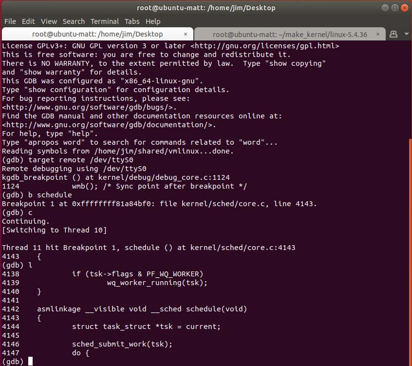{width="4.6722222222222225in" height="4.145833333333333in"}

**GDB Code Listing**

You can also enter interactive mode by pressing "Ctrl+X+A" which updates the code as you step from line to line, and you can navigate the code using the arrow keys/ "Page up"/ "Page Down". Sometimes it gets confused and won't let you move in the source -- to fix this just type "l" on the command line and it usually fixes it. The below show an example interactive session:

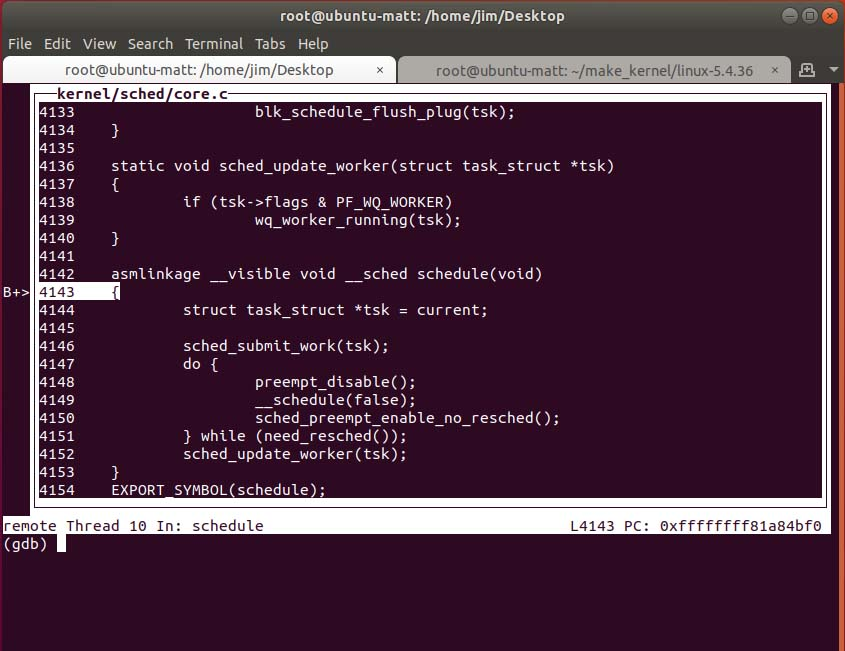{width="4.8493055555555555in" height="3.745138888888889in"}

**GDB Interactive Mode**

## 6. GDB Panic Tips

Sometimes stepping through the code will cause a kernel panic, or that may happen when you compile code yourself and it behaves improperly. To debug these, you can attach gdb (see section 5) before the system boots by adding the **kgdbwait** boot parameter as described above. Then continue to the first place an error occurs. If just stepping through code causes the panic, just avoid stepping through that function in the future and try setting targeted (source code line) breakpoints instead.

## 7. Conclusions

This should be enough to let you debug the Linux kernel purely in VMs. The steps in this article should help speed up your navigating/debugging. I hope that you've found this article helpful in getting started with Linux kernel development.

##  8. References

1.  **"Virtual Box",** <https://www.virtualbox.org/wiki/Downloads>

2.  **"Ubuntu 18.04.4 LTS (Bionic Beaver)",** <https://releases.ubuntu.com/18.04.4/>

3.  **"The Linux Kernel Archives",** <https://www.kernel.org/>

4.  **"Linux Magic System Request Key Hacks"**, <https://www.kernel.org/doc/html/latest/admin-guide/sysrq.html>

5.  **"Grub2/Setup",** <https://help.ubuntu.com/community/Grub2/Setup>

6.  **"Eclipse",** <https://www.eclipse.org/downloads/>

7.  **"help.eclipse.org/2020/3 and enter 'cdt' in search",** <https://help.eclipse.org/2020-03/index.jsp>

8.  **"GDB: The GNU Project Debugger,** <https://www.gnu.org/software/gdb/>

9.  **"GDB Command Reference",** <https://visualgdb.com/gdbreference/commands/>

10. **"Debugging kernel and modules via gdb"**, <https://www.kernel.org/doc/html/v4.10/dev-tools/gdb-kernel-debugging.html>

11. **"Run Levels in Linux",** <https://www.geeksforgeeks.org/run-levels-linux/>

##  APPENDIX A -- Boot Target VM back to GUI

It may be necessary to boot the Debugging VM back to Run Level 5 (GUI mode). It can be done temporally by rebooting the VM and stopping it in GRUB by hitting the shift key while it starts to boot. You should see a screen similar to:

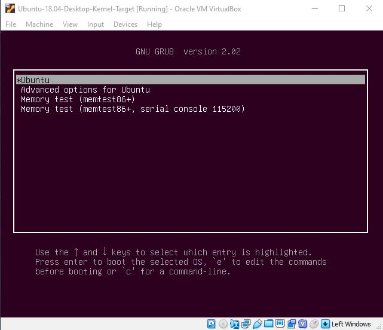{width="3.307638888888889in" height="2.8333333333333335in"}

Enter "e" for edit and you should now see the following screen:

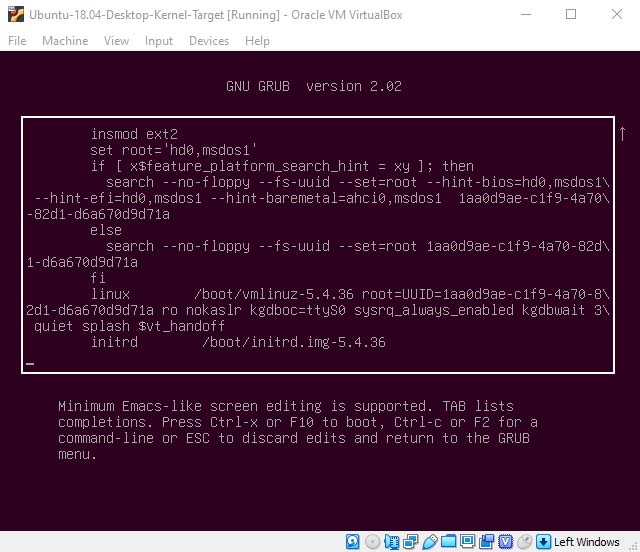{width="3.745138888888889in" height="3.2291666666666665in"}

Notice the line that starts with linux. On that line it shows **kgdbwait 3**. Use the arrow keys position at those words and remove that portion only.

Hit F10 to continue to boot. You should now see the Run Level 5 -- GUI login screen.

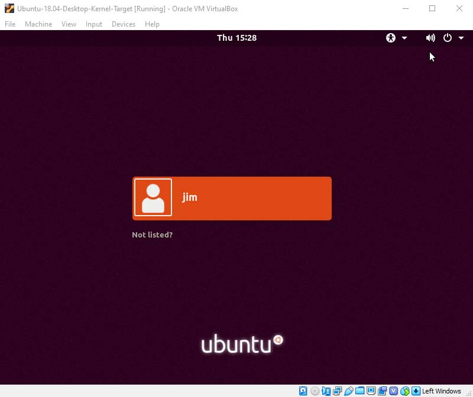{width="3.526388888888889in" height="2.963888888888889in"}

This setting will only remain at Run Level 5 until the next boot.
